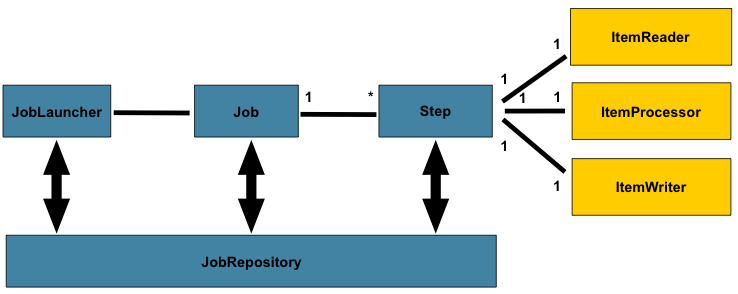

= 目录
:doctype: book
:toc: left
:toc-title: 我们的目标
:sectnums:
//:sectlinks:
:sectanchors:
:fn-hail-and-rainbow: footnote:disclaimer[try do it]
:fn-one: footnote:disclaimer[footnote1]
:fn-two: footnote:disclaimer[footnote2]

pass:[<link rel="stylesheet" href="https://cdnjs.cloudflare.com/ajax/libs/font-awesome/4.7.0/css/font-awesome.min.css">]

pass:[<link rel="stylesheet" href="https://cdnjs.cloudflare.com/ajax/libs/semantic-ui/1.6.2/semantic.min.css">]

[#target1]
== 目标其一

== 目标其二
[sidebar]
.Related information
--
This is aside text.

It is used to present information related to the main content.
--

pass:[<i class=conum data-value=1></i>]

[[heading,目标其三]]link:
== 目标其三{blank}

:cols: pass:[.>2,.>4]

[subs=+macros]
----
代码块 pass:quote[<i class=conum data-value=2></i>]
----

:app-name: MyApp^2^

[subs="specialchars,attributes,quotes,replacements,macros,post_replacements"]
The application is called {app-name}.

See <<heading>>.

The hail-and-rainbow protocol can be initiated at five levels:
double, tertiary, supernumerary, supermassive, and apocalyptic party.{fn-hail-and-rainbow}
A bold statement!{fn-one}

Another outrageous statement.{fn-two}

一行测试脚注的页面 footnote:[footnote1]

'''

****

我写代码,然后贴图片
****

'''

Here's text that will wrap around the image to the left.

'''
 Here's text that will wrap around the image to the left.

link:user_guide.ad[测试下,role=green]

