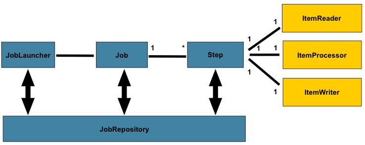

:experimental:
:icons: font
:conum-guard-js: //
ifndef::icons[:conum-guard-js: // //]
//:source-highlighter: highlightjs

//:stylesheet: https://cdnjs.cloudflare.com/ajax/libs/font-awesome/4.7.0/css/font-awesome.min.css

pass:[<link rel="stylesheet" href="https://cdnjs.cloudflare.com/ajax/libs/font-awesome/4.7.0/css/font-awesome.min.css">]

pass:[<link rel="stylesheet" href="https://cdnjs.cloudflare.com/ajax/libs/semantic-ui/1.6.2/semantic.min.css">]

{counter2:conum-value}
{conum-value}

:conum-value:
:conum: pass:[<i class=conum data-value=1 style="background-color:#6db33f!important"></i>]

[source,subs="attributes"]
----
{conum}
----

see <<link1>>

[.summary.incremental]
* Review 1
* Review 2

*free the world*

[big goal]*free the world*

[.big.goal]*free the world*

[%header%footer%autowidth]
|===
| Cell A | Cell B

| 1
| 2

|===

[options="header,footer,autowidth"]
|===
| Cell A | Cell B
|===

[#idname.rolename]
`monospace text`

---

[horizontal.properties%step]
property 1:: does stuff
property 2:: does different stuff

btn:[ok]

- Edgar Allen Poe
- Sheri S. Tepper
- Bill Bryson

//-

* Apples
* Oranges

//-

* Walnuts
* Almonds

//-

* The header in AsciiDoc must start with a document title.
+
----
= Document Title
----
+
Keep in mind that the header is optional.

* Optional Author and Revision information immediately follows the header title.
+
----
= Document Title
Doc Writer <doc.writer@asciidoc.org>
v1.0, 2013-01-01
----

//-

. {blank}
+
----
print("one")
----

. {blank}
+
----
print("one")
----

[%interactive]
* [*] checked
* [x] also checked
* [ ] not checked
* normal list item

Dairy:: Milk Eggs
Bakery:: Bread
Produce::
* Bananas

[qanda]
What is Asciidoctor?::
An implementation of the AsciiDoc processor in Ruby.
What is the answer to the Ultimate Question?::
42

:hide-uri-scheme:

The homepage for the Asciidoctor Project is https://asciidoctor.org.

Ask questions on the https://discuss.asciidoctor.org/[*mailing list*].

search/link:https://ecosia.org[Ecosia]

[#link1]
link:test.html#target1[test.html,window=_blank]

[source,java,subs="verbatim,quotes,attributes"]
.Test 测试类的描述
----
class Test {
    public void test() {
        System.out.println("Hello *bold* text");{conum}
    }
}
----

:markup-in-source: verbatim,quotes
[source,java,subs="{markup-in-source}"]
----
System.out.println("Hello *bold* text").
----

:version: 1.0.0
[source,xml,subs="attributes+"]
----
<version>{version}</version>
----

[source,xml,subs="-callouts"]
.An illegal XML tag
----
<1>
  content inside "1" tag
</1>
----

[source,xml,subs="attributes+,+replacements,-callouts"]
----
<version>{version}</version>
<copyright>(C) ACME</copyright>
<1>
  content inside "1" tag
</1>
----

The text pass:q[<u>underline *me*</u>] is underlined and the word "`me`" is bold.

[source,java,subs="+quotes,+macros"]
--
protected void configure(HttpSecurity http) throws Exception {
    http
        .authorizeRequests()
            **.antMatchers("/resources/$$**$$").permitAll()**
            .anyRequest().authenticated()
            .and()
        .formLogin()
            .loginPage("/login")
            .permitAll();
--

[subs=normal]
++++
Normal content which is not enclosed in a paragraph.
++++

====
[source,java,subs="verbatim,attributes"]
.Test 测试类的描述
----
class Test {
    public void test() {
        System.out.println("Hello bold text"); {conum}
    }
}
----
{conum} #解释# 下测试
====

|===
|Header 1 |Header 2 |Header 3

|Column 1, row 1
|Column 2, row 1
|Column 3, row 1

|Column 1, row 2
|Column 2, row 2
|Column 3, row 2

|Column 1, row 3
|Column 2, row 3
|Column 3, row 3
|===

[quote,yufr,2020-07-14]
____
this is what i said!
____

'''

.Lightweight Markup
****
Writing languages that let you type less and express more.
****

:home: https://example.org

Go {home}[Home].

//

//image::logo.png[Logo]

:link-fedpkg: pass:[https://apps.fedoraproject.org/packages/rubygem-asciidoctor[Asciidoctor package for Fedora]]

Did you know there's an {link-fedpkg}?

hello! do you have question? {conum}

:env-github:

ifdef::env-github[]
This content is for GitHub only.
endif::[]

ifndef::env-github[]
This content is not shown on GitHub.
endif::[]

ifeval::["{backend}" == "html5"]
backend is html5
endif::[]

[%interactive]
* [*] checked
* [x] also checked
* [ ] not checked
* normal list item

{counter2:pnum}

This is paragraph {pnum}.

{counter2:pnum}

This is paragraph {pnum}.

'''

The salad calls for {counter:seq1:1}) apples, {counter:seq1}) oranges and {counter:seq1}) pears.

:!seq1:
Dessert calls for {counter:seq1:A}) mangoes, {counter:seq1}) grapes and {counter:seq1}) cherries.

[caption=""]
.Parts{counter:index:0}
|===
|Part Id |Description

|PX-{counter:index}
|Description of PX-{counter:index}

|PX-{counter:index}
|Description of PX-{counter:index}
|===

:tip-caption: pass:[&#128161;]

[TIP]
It's possible to use Unicode glyphs as admonition icons.

[style,role="conum",data-value="1"]
test

[source,js,subs=attributes+]
----
var foo = "bar"; <2><3>
----

<1> 1
<3> test